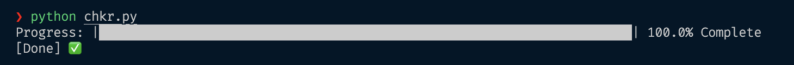

# Amazon Product Checker

This Python script fetches an Amazon product page if available with retry mechanism

## Prerequisites

- Python 3.9
- The following Python libraries:
  - `requests`
  - `beautifulsoup4`

You can install the required libraries using `pip`:

```bash
pip install requests beautifulsoup4
```

### RUN:

```bash
python chkr.py
```
